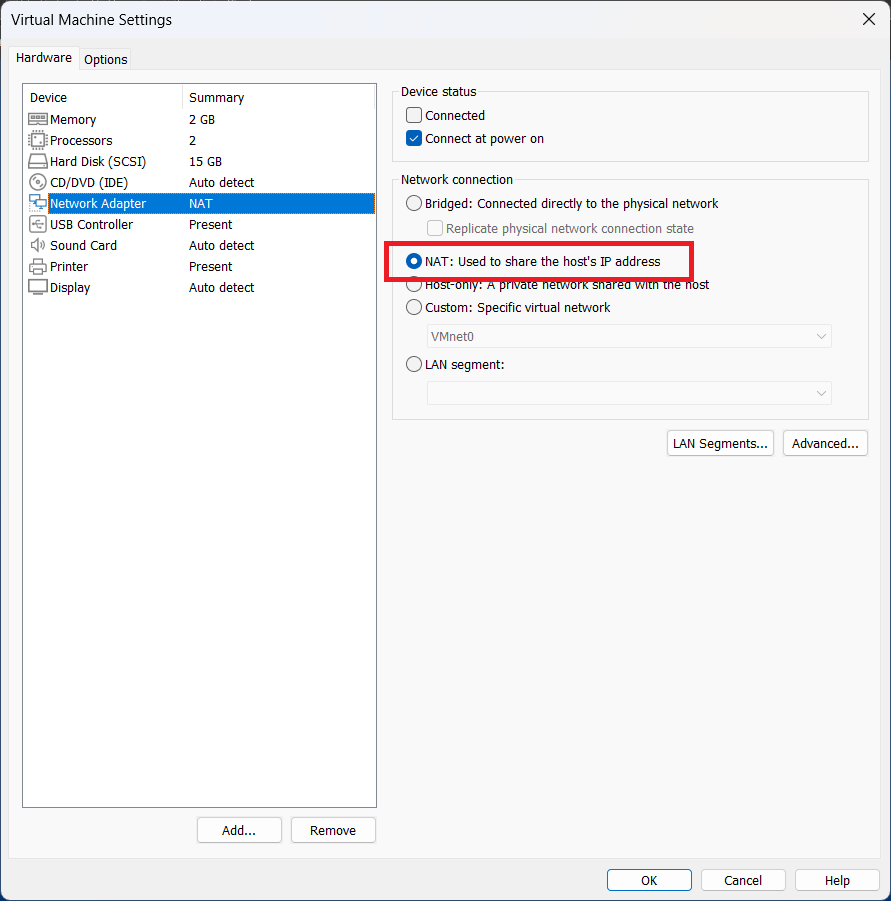
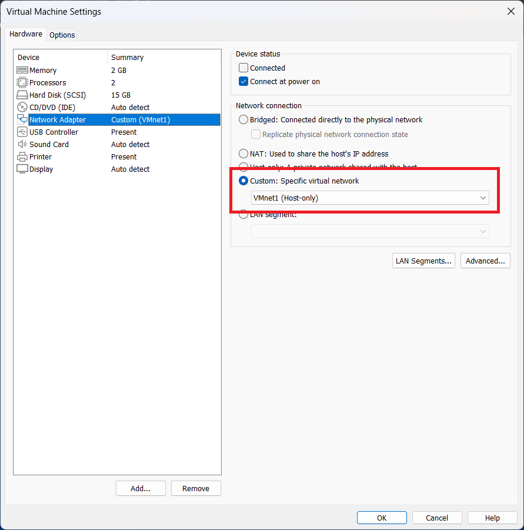

# Cấu hình DNS cơ bản trên DNS Server
## Nội dung
- **I. Hướng dẫn chuẩn bị**
  - **1. Fix lỗi gói yum không thể sử dụng**
  - **2. Cài đặt mạng và để cài gói bind (Với giao diện dòng lệnh)**
  - **3. Cài đặt lại IP tĩnh để tiến hành cấu hình DNS Server**
- **II. Cấu hình DNS cơ bản trong Linux Server**
  - **1. Cấu hình BIND**
  - **2. Khai báo zone**
  - **3. Tạo file record của các zone**
  - **4. Khởi động dịch vụ DNS**
- **III. Cấu hình backup DNS Server**
  - **1. Chuẩn bị**
  - **2. Cấu hình Main Server**
  - **3. Cấu hình Backup Server**
- **IV. Thiết lập Forwarder DNS Server**
  - **1. Chuẩn bị**
  - **2. Thiết lập Forwarder giữa 2 server**
- **V. Cấu hình phân quyền subdomain giữa các DNS Server (Delegation)**
  - **1. Thiết lập trên Main Server**
  - **2. Thiết lập trên Server được phân quyền**

## I. Hướng dẫn chuẩn bị
### 1. Fix lỗi gói yum không thể sử dụng
- Hãy chắc chắn trên VM có thể kết nối mạng bên ngoài

- Truy cập vào file ```/etc/yum.repos.d/CentOS-Base.repo```
- Uncomment các dòng bắt đầu bằng ```#baseurl``` -> ```baseurl```
- Thay đổi đường dẫn từ ```http://mirrorlist.centos.org``` -> ```https://vault.centos.org```
- Thay đổi đường dẫn từ ```http://mirror.centos.org``` -> ```https://vault.centos.org```
- Update lại gói yum bằng ```yum update -y``` và tiến hành ```reboot```
### 2. Cài đặt mạng và để cài gói bind (Với giao diện dòng lệnh)
- Truy cập vào file ```/etc/sysconfig/network-scripts/ifcfg-ens33```
- Cấu hình ```BOOTPROTO=dhcp```
- Khởi động lại dịch vụ mạng: ```systemctl restart network.service```
- Tiến hành cài đặt gói bind để cấu hình DNS: ```yum install bind* -y```
### 3. Cài đặt lại IP tĩnh để tiến hành cấu hình DNS Server
- Truy cập vào file ```/etc/sysconfig/network-scripts/ifcfg-ens33``` và tiến hành cấu hình:
```
BOOTPROTO=none
IPADDR=192.168.1.1
PREFIX=255.255.255.0
GATEWAY=192.168.1.1
DNS1=192.168.1.1
```
- Khởi động lại dịch vụ mạng: ```systemctl restart network.service```
- Kiểm tra địa chỉ IP: ```hostname -I```

## II. Cấu hình DNS cơ bản trong Linux Server
### 1. Cấu hình BIND
- Cấu hình tệp tin ```/etc/named.conf```
```C++
options {
  listen-on port 53 { 127.0.0.1; 192.168.1.1;}; // Lắng nghe ở địa chỉ Host
  //listen-on-v6 port 53 { ::1; };              // Không sử dụng IPv6
  allow-query { localhost; 192.168.1.0/24; }    // Cho phép truy vấn ở dải địa chỉ 192.168.1.0/24
  ...
}
```
### 2. Khai báo zone
- Định nghĩa các vùng phân giải xuôi và phân giải ngược trong tệp ```/etc/named.rfc1912.zones```
```C++
zone "bth.dkp.sgu" IN {             // Khai báo tên miền cần quản lý
  type master;                      // Đây là máy chủ phân giải chính
  file "bth.dkp.sgu.zone";          // Tên file lưu trữ record.
  allow-update { none; };           // không cho phép tự động update
};

zone "1.168.192.in-addr.arpa" IN {  // Khai báo zone của lớp 192.168.1.0
  type master;                      // Đây là máy chủ phân giải chính
  file "reverse.192.168.1.0";       // Tên file lưu trữ record.
  allow-update { none; };           // không cho phép tự động update
};
```
### 3. Tạo các file record cho các zone
- Truy cập các tệp theo đường dẫn đã định nghĩa tại các zone và tạo record
  - file ```/var/named/bth.dkp.sgu.zone``` cho ```bth.dkp.sgu```
  ```sh
  $ORIGIN bth.dkp.sgu.
  $TTL 1d
  @    IN    SOA    ns1.bth.dkp.sgu. admin.bth.dkp.sgu. (
          2024091801  ; Serial
          1w          ; Refresh
          2h          ; Retry
          4w          ; Expire
          1d          ; Minimum TTL
  )
  ; Định nghĩa Name Server, đchỉ IP của Name Server và tên miền chính
  @    IN  NS    ns1.bth.dkp.sgu.
  @    IN  A     192.168.1.1
  ns1  IN  A     192.168.1.1
  ```
  - file ```/var/named/reverse.192.168.1.0``` cho ```1.168.192.in-addr.arpa```

  ```sh
  $TTL 1d
  @    IN    SOA    ns1.bth.dkp.sgu. admin.bth.dkp.sgu. (
          2024091801  ; Serial
          1w          ; Refresh
          2h          ; Retry
          4w          ; Expire
          1d          ; Minimum TTL
  )
  ; Định nghĩa Name Server, tên miền khi phân giải đchỉ IP
  @    IN  NS    ns1.bth.dkp.sgu.
  1    IN  PTR   ns1.bth.dkp.sgu.
  1    IN  PTR   bth.dkp.sgu. 
  ```
### 4. Khởi động dịch vụ DNS 
- Để tránh việc bị chặn, hãy tắt firewall để DNS hoạt động
```
firewall-cmd --permanent --zone=public --add-service=dns
firewall-cmd --reload
```
- Khởi động dịch vụ DNS
```
systemctl enable named
systemctl start named
```
- Kiểm tra DNS bằng lệnh ```nslookup```

## III. Cấu hình backup DNS Server
### 1. Chuẩn bị
- Chuẩn bị sẵn gói BIND trên server backup
- Chuyển đổi Network Adapter trên cả 2 server trong VM thành ```VMNET1 (Host-only)```

- Cấu hình địa chỉ IP của server backup thành 192.168.1.2
### 2. Cấu hình Main Server
- Trên file cấu hình BIND ```/etc/named.conf/```, thiết lập thông số
```C++
options {             
  ...
  allow-transfer { localhost; 192.168.1.2; }; # Cho phép trao đổi dữ liệu giữa main server và bk server
  ...       
};
```
- Bổ sung record của server backup vào các file zone:
  - ```/var/named/bth.dkp.sgu.zone```

  ```sh
  $ORIGIN bth.dkp.sgu.
  $TTL 1d
  @    IN    SOA    ns1.bth.dkp.sgu. admin.bth.dkp.sgu. (
          2024091801  ; Serial
          1w          ; Refresh
          2h          ; Retry
          4w          ; Expire
          1d          ; Minimum TTL
  )
  ; Định nghĩa Name Server, đchỉ IP của Name Server và tên miền chính
  @    IN  NS    ns1.bth.dkp.sgu.
  @    IN  NS    ns2.bth.dkp.sgu.

  ns1  IN  A     192.168.1.1
  ns2  IN  A     192.168.1.2

  @    IN  A     192.168.1.1
  ```
  - ```/var/named/reverse.192.168.1.0```
  ```sh
  $TTL 1d
  @    IN    SOA    ns1.bth.dkp.sgu. admin.bth.dkp.sgu. (
          2024091801  ; Serial
          1w          ; Refresh
          2h          ; Retry
          4w          ; Expire
          1d          ; Minimum TTL
  )
  ; Định nghĩa Name Server, tên miền khi phân giải đchỉ IP
  @    IN  NS    ns1.bth.dkp.sgu.
  @    IN  NS    ns2.bth.dkp.sgu.

  1    IN  PTR   ns1.bth.dkp.sgu.
  2    IN  PTR   ns2.bth.dkp.sgu.

  1    IN  PTR   bth.dkp.sgu. 
  ```
- Khởi động dịch vụ DNS
```
systemctl enable named
systemctl start named
```
### 3. Cấu hình Backup Server
- Cấu hình tệp tin ```/etc/named.conf```
```C++
options {
  listen-on port 53 { 127.0.0.1; 192.168.1.2;}; // Lắng nghe ở địa chỉ Host
  //listen-on-v6 port 53 { ::1; };              // Không sử dụng IPv6
  allow-query { localhost; 192.168.1.0/24; }    // Cho phép truy vấn ở dải địa chỉ 192.168.1.0/24
  allow-transfer { localhost; 192.168.1.1; };   // Cho phép trao đổi dữ liệu giữa main server và bk server
  ...
}
```
- Thiết lập các vùng backup: ```/etc/named.rfc1912.zones```
```C++
...
zone "bth.dkp.sgu" IN {             // Khai báo tên miền cần quản lý
  type slave;                       // Đây là máy chủ backup
  file "slaves/bth.dkp.sgu.zone";   // Tên file backup.
  masters { 192.168.1.1; };         // Định nghĩa máy chủ chính
};

zone "1.168.192.in-addr.arpa" IN {  // Khai báo zone của lớp 192.168.1.0
  type slave;                       // Đây là máy chủ backup
  file "slaves/reverse.192.168.1.0";// Tên file backup.
  masters { 192.168.1.1; };         // Định nghĩa máy chủ chính
};
```
- Khởi động dịch vụ DNS
```
systemctl enable named
systemctl restart named
```
- Kiểm tra backup thành công hay chưa: ```ls /var/named/slaves```, ```nslookup```
- Sử dụng ```systemctl restart named``` nếu muốn đồng bộ toàn bộ dịch vụ
- Sử dụng ```rndc reload <zone-name>``` nếu muốn đồng bộ ở 1 zone cụ thể mà không ảnh hưởng đến dịch vụ khác
## IV. Thiết lập Forwarder DNS Server
### 1. Chuẩn bị
- Các yêu cầu chuẩn bị cũng giống với cấu hình Backup DNS Server, với 2 máy chủ có IP là:
  - Server 1: ```192.168.1.1```
  - Server 2: ```192.168.1.3```
### 2. Thiết lập Forwarder giữa 2 server
#### Server 1
- Thiết lập tại ```/etc/named.conf```
```C++
options {
  ...
  forwarders { 192.168.1.3; };  # Thiết lập forwarder là 192.168.1.3
  ...
  dnssec-enable no;             # Vô hiệu hóa hỗ trợ DNSSEC trên máy chủ DNS
  dnssec-validation no;         # Vô hiệu hóa việc xác thực DNSSEC
  ...
}
```
- Ta có thể tạm tắt tính năng Security của Linux, giúp cho việc trao đổi truy vấn DNS sẽ chạy ổn định hơn. 
  - ```/etc/sysconfig/selinux```

  ```
  ...
  SELINUX=disabled
  ...
  ```
#### Server 2
- Thiết lập tương tự như Server 1
- Cấu hình zone để kiểm tra trên Server 1
  ```/etc/named.rfc1912.zones```
  ```C++
  zone "qtm.org" IN {     
    type master;            
    file "qtm.org.zone";
    allow-update { none; };
  };
  ```
  ```/var/named/qtm.org.zone```
  ```sh
  $ORIGIN qtm.org.
  $TTL 1d
  @    IN    SOA    ns1.qtm.org. admin.qtm.org. (
          2024091801  ; Serial
          1w          ; Refresh
          2h          ; Retry
          4w          ; Expire
          1d          ; Minimum TTL
  )
  @    IN  NS    ns1.qtm.org.sgu.
  @    IN  A     192.168.1.3
  ns1  IN  A     192.168.1.3
  ```
#### Kết quả
- Khởi động dịch vụ DNS
```
systemctl enable named
systemctl restart named
```
- Dùng ```nslookup``` để kiểm tra

## V. Cấu hình phân quyền subdomain giữa các DNS Server (Delegation)
### Mô tả yêu cầu:
<p>
  Server 1 quản lý domain <a>cntt.dhsg</a><br>
  Server 2 được phân quyền quản lý miền con <a>ktpm.cntt.dhsg</a><br>
  Server 2 phân giải các đường dẫn <a>lnhp.ktpm.cntt.dhsg</a>, <a>ntd.ktpm.cntt.dhsg</a>...
</p>

### 1. Thiết lập trên Main Server
- Tệp ```/etc/named.rfc1912.zones```
```C++
zone "cntt.dhsg" IN {     
  type master;            
  file "cntt.dhsg.zone";
  allow-update { none; };
  allow-query { any; };
};
```
- Tệp ```/var/named/cntt.dhsg.zone```
```sh
$ORIGIN cntt.dhsg.
$TTL 1d
@    IN    SOA    ns1.cntt.dhsg. admin.cntt.dhsg. (
        2024091801  ; Serial
        1w          ; Refresh
        2h          ; Retry
        4w          ; Expire
        1d          ; Minimum TTL
)
@    IN  NS    ns1.cntt.dhsg.
ns1  IN  A     192.168.1.1
@    IN  A     192.168.1.1

; Delegate subdomain ktpm.cntt.dhsg for 192.168.1.2
$ORIGIN ktpm.cntt.dhsg.
@    IN  NS    ns2.ktpm.cntt.dhsg.
ns2  IN  A     192.168.1.2
```
### 2. Thiết lập trên Server được phân quyền
- Tệp ```/etc/named.rfc1912.zones```
```C++
zone "ktpm.cntt.dhsg" IN {     
  type master;            
  file "ktpm.cntt.dhsg.zone";
  allow-update { none; };
  allow-query { any; };
};
```
- Tệp ```/var/named/ktpm.cntt.dhsg.zone```
```sh
$ORIGIN ktpm.cntt.dhsg.
$TTL 1d
@    IN    SOA    ns2.ktpm.cntt.dhsg. admin.ktpm.cntt.dhsg. (
        2024091801  ; Serial
        1w          ; Refresh
        2h          ; Retry
        4w          ; Expire
        1d          ; Minimum TTL
)
@         IN  NS    ns2.ktpm.cntt.dhsg.
@         IN  A     192.168.1.2
ns2       IN  A     192.168.1.2

; Other records
lnhp      IN  A     192.168.1.11
ntd       IN  A     192.168.1.22
ohmygoat  IN  A     10.10.10.10
```
- Sau khi hoàn thành, ```systemctl restart named``` để khởi động lại service và dùng ```nslookup``` trên main server để kiểm tra phân quyền
